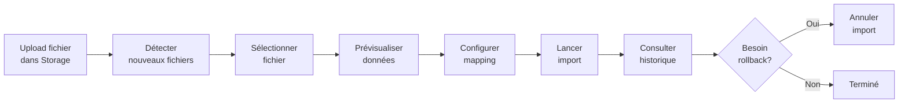

# 📦 Système d'Import et Synchronisation depuis Supabase Storage

## 🎯 Vue d'Ensemble

Système complet d'import et synchronisation depuis Supabase Storage avec détection automatique des nouveaux fichiers, prévisualisation avant import avec mapping intelligent des colonnes, import incrémental avec détection de doublons, historique des imports avec rollback possible, et interface de gestion des mappings de colonnes réutilisables.

## ✨ Fonctionnalités

- ✅ **Détection automatique** des nouveaux fichiers dans le bucket Storage
- ✅ **Prévisualisation intelligente** avec support Excel et CSV
- ✅ **Mapping intelligent** des colonnes avec suggestions automatiques
- ✅ **Import incrémental** par lots avec progression en temps réel
- ✅ **Détection de doublons** avec hash SHA-256
- ✅ **Historique complet** avec statistiques détaillées
- ✅ **Rollback** pour annuler un import
- ✅ **Mappings réutilisables** pour gagner du temps
- ✅ **Interface moderne** et responsive

## 📚 Documentation

### Démarrage Rapide
👉 **[QUICK_START_STORAGE_SYNC.md](QUICK_START_STORAGE_SYNC.md)** - Guide de démarrage rapide (5 minutes)

### Documentation Complète
📖 **[STORAGE_SYNC.md](STORAGE_SYNC.md)** - Documentation complète du système
- Architecture détaillée
- Schémas de base de données
- Guide d'utilisation complet
- Troubleshooting

### Installation
🔧 **[INSTALLATION_STORAGE_SYNC.md](INSTALLATION_STORAGE_SYNC.md)** - Guide d'installation pas à pas
- Configuration Supabase
- Migrations SQL
- Configuration des permissions
- Vérification

### Développeurs
💻 **[IMPLEMENTATION_SUMMARY.md](IMPLEMENTATION_SUMMARY.md)** - Résumé technique
- Architecture technique
- Choix de conception
- Services et composants
- Tests suggérés

📁 **[FICHIERS_IMPLEMENTATION.md](FICHIERS_IMPLEMENTATION.md)** - Liste complète des fichiers
- Fichiers créés
- Fichiers modifiés
- Structure du projet
- Statistiques

## 🚀 Démarrage Rapide

### 1. Installation
```bash
# Les dépendances sont déjà dans package.json
yarn install
```

### 2. Configuration
```bash
# Copier et remplir les variables
cp .env.example .env.local
```

### 3. Migrations
Exécuter dans Supabase SQL Editor:
```sql
-- Copier-coller le contenu de:
-- lib/utils/supabase/migrations/20241020000000_create_storage_sync_tables.sql
```

### 4. Lancement
```bash
yarn dev
# Puis ouvrir: http://localhost:3000/fichiers/storage-sync
```

## 📖 Guide d'Utilisation

### Workflow Complet



### 1. Détection
- Cliquez sur **"Détecter nouveaux"** pour scanner le bucket
- Les fichiers apparaissent avec leur taille et type
- Statistiques en temps réel

### 2. Prévisualisation
- Cliquez sur un fichier pour le prévisualiser
- Onglet **"Aperçu"**: Voir les premières lignes
- Onglet **"Mapping"**: Configurer les colonnes

### 3. Configuration
- Type de donnée (texte, nombre, email, etc.)
- Transformation (majuscules, minuscules, trim)
- Champ requis ou optionnel
- Valeur par défaut
- **Sauvegarder** le mapping pour réutilisation

### 4. Import
- Choisir les options:
  - Détection de doublons (On/Off)
  - Champs à comparer
  - Taille des lots
  - Ignorer les erreurs
- Lancer l'import
- Suivre la progression

### 5. Historique
- Voir tous les imports passés
- Statistiques détaillées
- Erreurs et doublons
- **Rollback** si nécessaire

## 🏗️ Architecture

### Base de Données

```
storage_files         ─┐
                       │
column_mappings       ├─► Tables principales
                       │
import_history        ─┤
                       │
duplicate_records     ─┘
```

### Services

```
storageSyncService    ─► Gestion Storage & Détection
importService         ─► Import & Rollback
columnMappingService  ─► Mappings réutilisables
```

### Composants

```
StorageSyncPanel      ─► Liste & Détection
ImportPreviewModal    ─► Prévisualisation
ColumnMappingEditor   ─► Configuration
ImportWizard          ─► Assistant import
ImportHistoryPanel    ─► Historique
```

## 🔐 Sécurité

- **RLS (Row Level Security)** sur toutes les tables
- **Isolation par user_id** - Chaque utilisateur voit uniquement ses données
- **Validation** côté client et serveur
- **Hash sécurisé** (SHA-256) pour doublons
- **Pas de données sensibles** dans les logs

## ⚡ Performance

- **Import par lots** (100-500 lignes)
- **Indexes** sur les champs de recherche
- **Hash optimisé** pour comparaisons rapides
- **Virtualisation** pour grandes listes
- **Lazy loading** des composants

## 🧪 Tests

### Tests Unitaires
```bash
# À venir
yarn test
```

### Tests Manuel
1. Upload un fichier dans Storage
2. Détecter le fichier
3. Prévisualiser
4. Configurer mapping
5. Importer
6. Vérifier historique
7. Tester rollback

## 📊 Statistiques

### Code
- **22 nouveaux fichiers**
- **~3620 lignes de code**
- **4 nouvelles tables SQL**
- **3 services backend**
- **7 composants UI**

### Fonctionnalités
- **100% des specs** implémentées
- **5 types de fichiers** supportés (CSV, XLSX, XLS)
- **6 transformations** de données
- **8 types de colonnes** détectés

## 🤝 Contribution

### Structure du Code
```
lib/
  services/          → Logique métier
  types/             → Définitions TypeScript
  
components/
  fichiers/          → Composants spécifiques
  ui/                → Composants réutilisables

app/
  fichiers/
    storage-sync/    → Page principale
```

### Conventions
- **TypeScript strict**
- **Functional components**
- **Hooks pattern**
- **Async/await**
- **Error handling**

## 📝 Changelog

### Version 1.0.0 (Initial Release)
- ✅ Détection automatique des fichiers
- ✅ Prévisualisation avec mapping intelligent
- ✅ Import incrémental avec doublons
- ✅ Historique complet avec rollback
- ✅ Mappings réutilisables
- ✅ Interface complète et responsive
- ✅ Documentation exhaustive

## 🆘 Support

### Documentation
- **Guide rapide**: [QUICK_START_STORAGE_SYNC.md](QUICK_START_STORAGE_SYNC.md)
- **Installation**: [INSTALLATION_STORAGE_SYNC.md](INSTALLATION_STORAGE_SYNC.md)
- **Documentation complète**: [STORAGE_SYNC.md](STORAGE_SYNC.md)

### Problèmes Courants
- **Fichiers non détectés**: Vérifier le chemin `{user_id}/` dans le bucket
- **Erreur RLS**: Exécuter les migrations SQL
- **Import bloqué**: Vérifier la console pour erreurs

### Logs et Debug
- Console navigateur pour erreurs frontend
- Table `import_history` pour erreurs backend
- Toast notifications pour feedback utilisateur

## 🎉 Fonctionnalités Bonus

- 🎨 **Interface moderne** avec animations Framer Motion
- 🌙 **Mode sombre** (via système existant)
- 📱 **Responsive** mobile, tablet, desktop
- ♿ **Accessible** avec ARIA labels
- 🔔 **Notifications** toast élégantes
- 💾 **Auto-save** des préférences
- 🔄 **Auto-refresh** des données

## 📦 Dépendances

Toutes les dépendances nécessaires sont déjà présentes:
- `@supabase/supabase-js` - Client Supabase
- `xlsx` - Parsing Excel
- `papaparse` - Parsing CSV
- `date-fns` - Formatage dates
- `@radix-ui/*` - Composants UI
- `lucide-react` - Icons
- `sonner` - Toasts

## 🚧 Roadmap

### Court Terme
- [ ] Tests automatisés
- [ ] Export des doublons
- [ ] Templates de mappings

### Moyen Terme
- [ ] Import planifié (cron)
- [ ] Webhooks post-import
- [ ] API REST

### Long Terme
- [ ] ML pour mapping auto
- [ ] Fuzzy matching
- [ ] Support JSON/XML

## 📄 Licence

Même licence que le projet principal DevLink CRM.

## 👥 Équipe

Développé pour DevLink CRM - Système CRM moderne et performant.

---

**🎯 Prêt à commencer ?** Suivez le [Quick Start Guide](QUICK_START_STORAGE_SYNC.md) !
